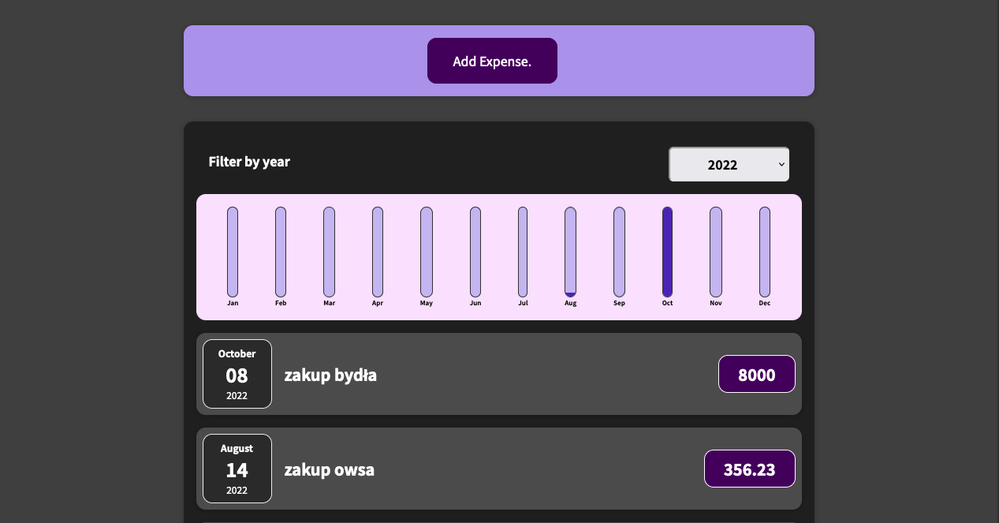

# Expense Tracker

A simple React project for tracking expenses, with the option to filter by year and a form for adding expenses.
Demo

The project is deployed on Netlify and can be accessed at: https://expense-tracker-pan-be.netlify.app/
Description

This is a basic demonstration application with pseudo data to track expenses. It allows the user to filter expenses by year and displays a chart of expenses for the last twelve months. The user can add new expenses using a simple form. Note that the application is only a graphical representation of the functionality and does not connect to any database.
Technologies

    React
    Chart.js

Installation

    Clone the repository: git clone https://github.com/your-username/expense-tracker.git
    Install dependencies: npm install
    Start the development server: npm start

Contributing

Contributions are welcome! If you find any bugs or have suggestions for new features, feel free to submit an issue or create a pull request.
License

This project is licensed under the MIT License.
